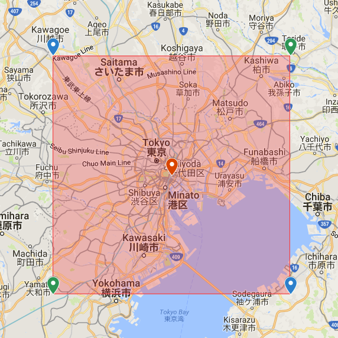

gonetatmo
=====

# Overview
This is a CLI tool to retrieve data from a personal weather station of Netatmo.

# Demo

In this demonstration, at first, it retrieves data from own Netatmo. And then, all values in a square area 50 km on a side are retrieved as centering on Tokyo station, and the average values are displayed.

# Description
I have [a personal weather station of Netatmo](https://www.netatmo.com/en-US/product/weather/weatherstation). I check the data of my local environment using it. In most case, I have used my browser to retrieve the data so far. [About retrieving data using curl, I have created it before.](https://github.com/tanaikech/cui4netatmo) Recently, I thought that I wanted to create this as a CLI too. So I created this. This tool can retrieve not only the data of own Netatmo, but also the data of specific area using Netatmo APIs. By this, I got to be able to retrieve easily the data of various places. This tool has the following features.

- Retrieves data from Netatmo.
- Using [Getstationsdata](https://dev.netatmo.com/resources/technical/reference/weatherstation/getstationsdata), retrieve data of own Netatmo.
- Using [Getmeasure](https://dev.netatmo.com/resources/technical/reference/common/getmeasure), retrieve past data of own Netatmo.
- Using [Getpublicdata](https://dev.netatmo.com/en-US/resources/technical/reference/weatherapi/getpublicdata), retrieve data of various places.
    - For using Getpublicdata, you can retrieve data by inputting the address using [Google Maps Geocoding API](https://developers.google.com/maps/documentation/geocoding/intro?hl=en).

# How to Install
Download an executable file of gonetatmo from [the release page](https://github.com/tanaikech/gonetatmo/releases) and import to a directory with path.

or

Use go get.

~~~bash
$ go get -u github.com/tanaikech/gonetatmo
~~~

## Retrieve tokens
**In gonetatmo, data is retrieved using [Netatmo API](https://dev.netatmo.com/en-US/resources/technical/reference) and [Google Maps Geocoding API](https://developers.google.com/maps/documentation/geocoding/intro?hl=en).**

### For Netatmo API
After download or install gonetatmo, in order to use APIs, please retrieve client ID, client Secret from Netatmo.

- If you don't have an account of Netatmo, please create an account at [https://auth.netatmo.com/](https://auth.netatmo.com/).
- If you have an account of Netatmo, you can retrieve them as follows.
    1. Login to Netatmo.
    1. Access to [https://dev.netatmo.com/](https://dev.netatmo.com/).
    1. Click "CREATE YOUR APP".
    1. Input each parameters.
    1. Click "CREATE AN APP.".
    1. Copy Client id and Client secret.
    1. Run the following command.
        - email and password are them that you use to login to Netatmo.

~~~
$ gonetatmo --clientid ### --clientsecret ### --email ### --password ###
~~~

### For Google Maps Geocoding API
- If you want to use [Google Maps Geocoding API](https://developers.google.com/maps/documentation/geocoding/intro?hl=en), please retrieve your API key.
    - [Get API Key](https://developers.google.com/maps/documentation/geocoding/get-api-key?hl=en).
    - After retrieve the API key, run the following command.

~~~
$ gonetatmo --key ###
~~~

By above commands, ``gonetatmo.cfg`` is created. You can also set the directory of ``gonetatmo.cfg`` using the environment variable of ``GONETATMO_CFG_PATH``. For example, you can set the following script to ``.bashrc``.

~~~bash
export GONETATMO_CFG_PATH=c:/foo/bar
~~~

# Usage
### Help
~~~bash
$ gonetatmo --help
~~~

### Retrieve data from own Netatmo
~~~bash
$ gonetatmo
~~~

- This can be seen at the demonstration movie.
- If you want to retrieve the data as JSON object, please run as follows. In this case, the raw data from Netatmo can be retrieved.
- ``$ gonetatmo -raw``

### Retrieve past data from own Netatmo
~~~bash
$ gonetatmo m -di "### your device ID ###" -b 2018-01-01T00:00:00+00:00 -e 2018-01-02T00:00:00+00:00
~~~

- ``-b 2018-01-01T00:00:00+00:00`` and ``-e 2018-01-02T00:00:00+00:00`` mean that the data from ``2018-01-01T00:00:00+00:00`` to ``2018-01-02T00:00:00+00:00``.

### Retrieve data of a specific area using latitude and longitude
~~~bash
$ gonetatmo p -lat 35.681167 -lon 139.767052 -r 50
~~~

- ``-r 50`` means that all values in a square area 50 km on a side are retrieved as centering on (35.681167, 139.767052), and the average values are displayed.
- When ``-raw`` is used, you can retrieve the raw data from Netatmo.

### Retrieve data of a specific area using address and place name
~~~bash
$ gonetatmo p -a "tokyo station" -r 50
~~~

- In this case, API key for using [Google Maps Geocoding API](https://developers.google.com/maps/documentation/geocoding/intro?hl=en) is required.
- This can be seen at the demonstration movie.

#### About the retrieved area
When you run the command of ``$ gonetatmo p -a "tokyo station" -r 50``, the following flow is run.

1. "tokyo station" is converted to the coordinate using Google Maps Geocoding API.
    - The converted coordinate means the center of area.
    - It's ``(35.6811673000, 139.7670516000)``.
1. ``-r 50`` means a square area 50 km on a side.
    - The coordinates of North east corner and South west corner are calculated.
    - Those are ``(35.9064834975, 140.0432177479)`` and ``35.4558511025, 139.4908854521``.
1. All values of the square area 50 km on a side are retrieved using Netatmo API.

You can see above flow as an image. The orange anchor is the center coordinate. The green anchors of upper right and lower left are the calculated points. The values are retrieved from the red colored area.

-----

# Licence
[MIT](LICENCE)

# Author
[Tanaike](https://tanaikech.github.io/about/)

If you have any questions and commissions for me, feel free to tell me.

# Update History
* v1.0.0 (March 1, 2018)

    1. Initial release.

[TOP](#TOP)
